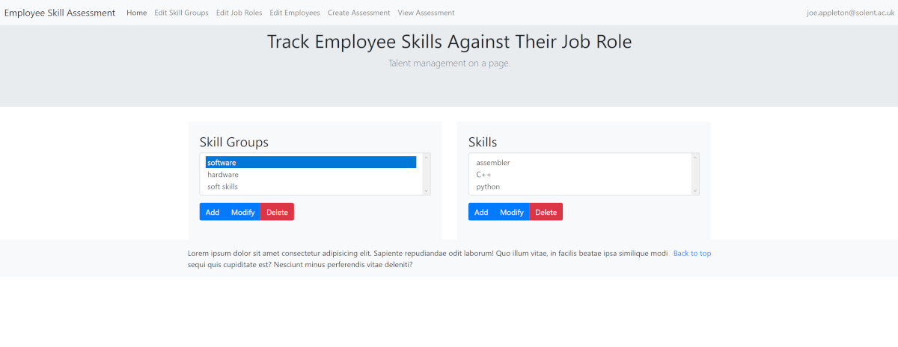
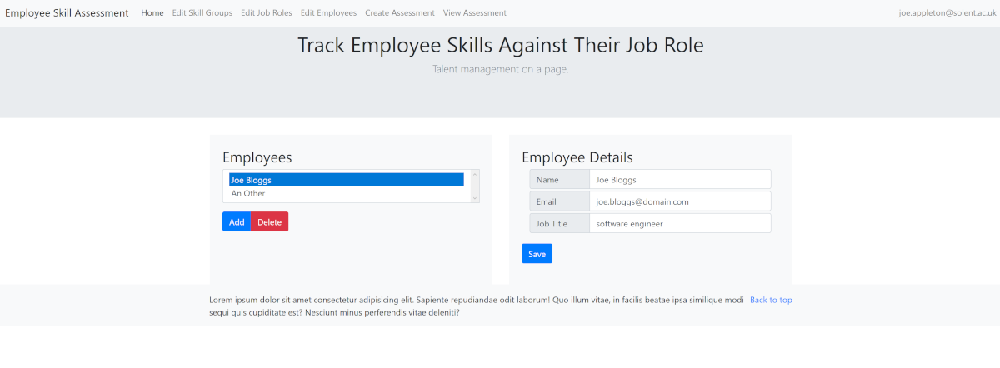
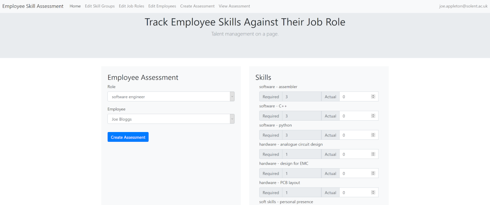
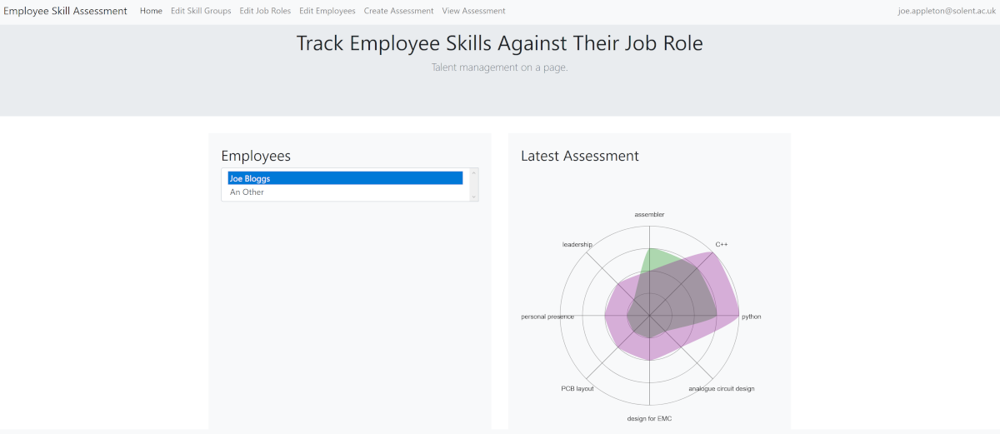

# Skilled - Assessment 1 of COM519 - Advanced Database Systems


Skilled is a simple webapp designed as a tool to track the level of expertise
team members have against a set of role requirements. The goal is to create a
visualisation of where team members are that can be used to justify where effort
should be invested to improve their capabilities.

Skilled allows registered users to:
* define groups of relevant skills that a team should have
* define roles with different skill levels
* add / remove team members
* create / view assessments of team members against the defined roles

Skilled was developed as a work based project for the `COM519 - Advanced
Database Systems` module taught by [Solent University](https://www.solent.ac.uk/)

## Software Dependencies
The following must be installed or accessible:
* `node js` [Node JS website](https://nodejs.org/en/)
* `mongodb` [MongodDB website](https://www.mongodb.com/)
  if not installed locally must be accessible as a network / hosted resource

## Installation
Checkout the code from github using:

`git clone https://github.com/Grahame-student/COM519_AE1_Skilled.git`

_The location the code is checked out into should not have any spaces in its
path, some npm packages have problems installing to them._

Install the required node packages using:

`npm install`

Create a `.env` file using the provided `.env.template` file
* Set `BASE_URI` to the URI to use for the `Skilled` webapp
* Set `PORT` to the port number to listen on
* Set `MONGODB_URI` to the URI of your mongodb database
* Set `SESSION_SECRET` to a secret string

**The .env file should not be checked into a version control system as some of
these values could be used to compromise the security of the webapp**

When deploying to a hosted service ensure that the .env file is either uploaded
to the hosted service or appropriate environment variables are set.
Additionally, you will need to set the following values:
* Set `API_BASE` to the URI of your hosted webapp
* Set `NODE_ENV` to `production`

These values ensure that the real URIs are used and not any defined for local
development / debugging activities.

## Preparation
In the tools directory there is a `seeder.js` script, and a `skills.json` file
containing sample data. These should be used to initialise the collections
within the database. To start from a blank database remove all the entities
from each of the top level groups so that the `skills.json` file only contains:

```json
{
  "skills": [],
  "roles": [],
  "employees": [],
  "users": []
}
```

**Running this script against a previously populated database will completely
remove any stored data before importing the seed data. This operation cannot
be reversed**

To seed the database navigate to the directory that the code was checked out
into and use:

`node seeder.js`

The following output should be seen on the command prompt

* `Importing table: skills`
* `Importing table: roles`
* `Importing table: employees`
* `Importing table: users`
* `Initialised skills database with sample data`

## Usage
To start the `Skilled` application navigate to the directory that the code was
checked out into and use:

`node app.js`

The following output should be seen on the command prompt

`Skilled app listening at http://localhost:2020`

Navigate to the URL shown, using your web browser, and the application's main
page should be displayed.

**The web app uses some features of HTML 5, CSS 3 and JS that Internet Explorer
is known to not support**


### Registering
In order to use many of the features offered by `Skilled` a user account must
first be created. Currently, this is a self registration process with no
backend verification of who has registered. Users that have self registered are
stored in the `users` collection of the backend database. No personal
information is stored beyond an email address and password details (in the form
of a salted hash). Where no verification process has been implemented, emails
only need to be unique, and pass the standard email format validation checks
implemented by the web browser.

### Signing in
The same form can be used to sign in using the previously registered
credentials. A signed-in user will be able to access all the implemented
functionality of the `Skilled` application.

### Configuring Skill Groups and Skills
The skill groups and individual skills within them can be configured by
following the `Edit Skill Groups` link.



* On the left, the available skill groups can be added to, renamed and deleted.
* On the right, the skills within the currently selected group can be added,
renamed and deleted.

If a skill was previously used in a role definition or in an employee
assessment then it will be unaffected by any modifications. This allows roles
to evolve over time without a complex set of table dependencies. It also makes
it possible to potentially revisit an old version of a role, or a previously
carried out assessment without it being affected by recent changes.
**The ability to go back to older versions of roles or older employee
assessments has not yet been implemented, however the data in the database is
structured to make this relatively simple to add.**

### Configuring Job Roles and Skill Requirements
The job roles and skill requirements for each role can be configured by
following the `Edit Job Roles` link.


* On the left, the available job roles can be added to, renamed and deleted.
* On the right, the level of skill required by the selected job role can be set
to a value between 0 (not required) to 4 (expert).

Adding a new job role will create an entry in the `roles` collection containing
all the groups and skills currently defined in the `skills` collection. By
default, the required level for all skills will be 0. Once the levels have been
set and reviewed click save to store them in the database. To revise the skill
requirements of an existing role, select it, set the levels as necessary and
then click save.

Saving a role will add a new timestamped entry to the role's required skills
field, making to possible to review changes to a role over time in a future
feature update.

### Configuring Employees
Employees and their details can be configured by following the `Edit Employees`
link.



* On the left, employees can be added and deleted.
* On the right, employee details can be modified and saved.

Adding a new employee will create an employee placeholder, which will be
visible in the employee list and employee details. Once selected the employee's
details can be configured and saved to the database. As employees from
different locations around the globe may have different titles for the same
role the decision was made not to use the role to populate the title field.
Names may be the same within a business but email addresses are unique and are
therefore used as the primary method of referencing a specific employee.

### Creating Employee Assessments
Employees assessments can be created by following the `Create Assessment` link.



* On the left, an assessment can be created.
* On the right, the achieved skill levels can be populated.

An employee can be assessed against any of the available roles making it simple
to monitor an employee's capabilities even if they are promoted or change
specialisation. A new assessment will use the most upto date set of required
skills associated with the selected role. New assessments will have a value of
0 for all achieved skill levels by default.

After all the skills have been assigned the required level, the save button
can be used store the values in the database.

### View Employee Assessments
Completed employees assessments can be viewed by following the `View
Assessment` link.



* On the left, a list of employees to review the assessments of.
* On the right, a radar chart of all the skills from the employee's latest
  assessment.

The generated radar chart highlights the area representing the required skills
in green and the area representing the achieved skills in purple. Both areas
have an alpha channel applied so that when one area overlays the other both are
still visible.

**Currently only the latest employee assessment is displayed, however the
database is structured so that previous assessments are also saved, along will
all data needed to generate a visualisation of the assessment, even if roles
and skills have changed since the assessment was recorded**
